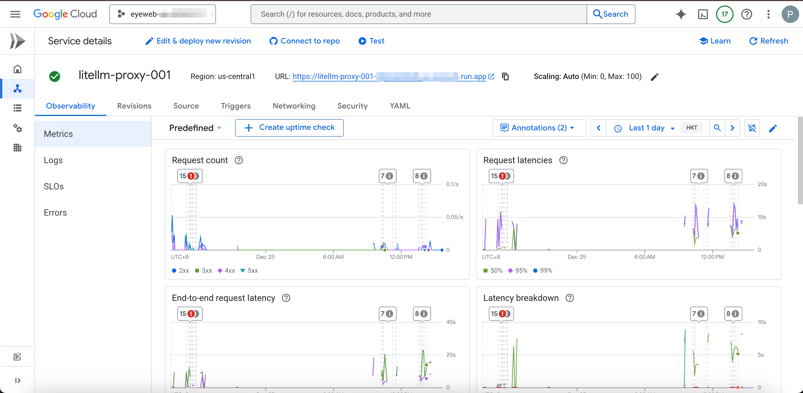

# LiteLLM Cloud Run 代理服务部署方案

## 1. 核心目标
构建一个基于 Google Cloud Run 的 LiteLLM 代理服务，实现 OpenAI 接口格式兼容，统一管理 Vertex AI (Gemini) 等模型访问，解决跨区域访问限制及接口适配问题。

## 2. 架构设计

*   **计算平台**: Google Cloud Run (Serverless, 自动扩缩容)
*   **核心组件**: [LiteLLM](https://github.com/BerriAI/litellm) (Docker 镜像)
*   **配置管理**: Google Secret Manager (安全存储 `config.yaml`)
*   **身份认证**:
    *   **客户端 -> 代理**: Master Key (Bearer Token)
    *   **代理 -> Vertex AI**: Service Account (IAM 角色 `roles/aiplatform.user`)

## 3. 核心流程

1.  **配置定义** (`config.yaml`):
    *   定义模型映射 (如 `gemini-3.0-pro` -> `vertex_ai/gemini-3.0-pro-preview`)。
    *   绑定 GCP 项目与区域 (`vertex_project`, `vertex_location`)。
2.  **自动化部署** (`deploy.sh`):
    *   **环境准备**: 设置 Project ID, Region, Master Key。
    *   **权限管理**: 创建 Service Account (`litellmsa`) 并授权。
    *   **配置同步**: 将 `config.yaml` 上传至 Secret Manager。
    *   **服务发布**: 部署 Cloud Run 服务，挂载 Secret，注入环境变量。
3.  **服务调用**:
    *   客户端使用 OpenAI SDK 或 curl，指向 Cloud Run URL。
    *   Header 携带 `Authorization: Bearer <MY_MASTER_KEY>`。

## 4. 关键文件引用

| 文件路径 | 作用描述 | 关键配置项 |
| :--- | :--- | :--- |
| `deploy.sh` | 主部署脚本 | `gcloud run deploy`, `gcloud secrets create`, IAM 绑定 |
| `config.yaml` | 模型路由配置 | `model_list`, `litellm_settings` |
| `clean.sh` | 资源清理 | 删除 Service, Secret, Service Account |
| `deploy_by_apikey/` | API Key 模式 | 适用于非 Vertex AI 原生认证场景 (如直接使用 Gemini API Key) |

## 5. 部署操作指南

1.  **获取代码**
    ```bash
    git clone https://github.com/guyue55/litellm-cloudrun.git
    cd litellm-cloudrun
    ```

2.  **配置模型映射** (`config.yaml`)
    修改 `model_list` 定义需要的模型别名与 Vertex AI 模型 ID 的对应关系。

3.  **配置部署参数** (`deploy.sh`)
    编辑脚本头部变量：
    *   `PROJECT_ID`: GCP 项目 ID
    *   `REGION`: 部署区域 (如 `us-central1`)
    *   `MY_MASTER_KEY`: 设置访问代理的密钥 (即 API Key)

4.  **执行部署**
    ```bash
    bash deploy.sh
    ```
    *脚本将自动创建 Service Account、Secret 并部署 Cloud Run 服务。*

5.  **验证服务**
    部署完成后获取 URL，使用 curl 测试：
    ```bash
    curl -X POST https://<YOUR-CLOUD-RUN-URL>/chat/completions \
      -H 'Authorization: Bearer <MY_MASTER_KEY>' \
      -H 'Content-Type: application/json' \
      -d '{
        "model": "gemini-3.0-pro-preview",
        "messages": [{"role": "user", "content": "Hello"}]
      }'
    ```

6.  **部署截图**



## 6. 总结

*   **零代码迁移**: 兼容 OpenAI 接口，现有应用仅需修改 Base URL 和 Key。
*   **网络连通性**: 利用 Cloud Run 解决部分地区的 Google API 访问受限问题。
*   **安全合规**: 敏感配置 (Config) 托管于 Secret Manager，最小权限原则 (IAM)。
*   **低运维成本**: 一键脚本部署，Serverless 架构免去服务器维护。

